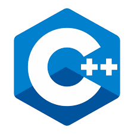
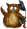
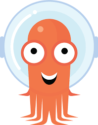

### Hi there, i'm [QI](https://github.com/guoqiangqi)(he/his) 👋

- 🌱 An open-source enthusiast and familiar with [Deep Learning](https://en.wikipedia.org/wiki/Deep_learning)(Object Detection) / [AutoML](https://en.wikipedia.org/wiki/Automated_machine_learning)(NAS) and [Numerical Optimization](https://en.wikipedia.org/wiki/Mathematical_optimization).  

- 🔭 I used to be a core contributor to [Eigen](https://gitlab.com/libeigen/eigen)(as a member), which is a C++ template library for linear algebra: matrices, vectors, numerical solvers, and related algorithms. Eigen is also used in [Tensorflow](https://github.com/tensorflow/tensorflow).  

- ✨ Also, i made contributions to [Numba](https://github.com/numba/numba), which is a JIT compiler that translates a subset of Python and NumPy code into fast machine code for scientific computing.

- ⚡ I own the [PFLD](https://github.com/guoqiangqi/PFLD) Github Project, that is an open-source implementation based on Tensorflow for [Face Landmark Detection](https://github.com/guoqiangqi/PFLD).

#### Languages and Tools

<code></code>
<code></code>
<code></code>
<code></code>
<code></code>
<code></code>
<code></code>
<code></code>
<code></code>
<code></code>

### Stats on Github

### Contact me 💬
🏠 <guoqiang.qi1@gmail.com> | 🏢 <qiguoqiang2@huawei.com>

### 简介
开源爱好者，学硬件的软件工程师，华为胶片工程师。早期研究方向为深度学习领域目标检测&识别，因复现PFLD网络并开源接触社区；加入华为2012实验室后负责业界&自研数学库性能优化，开源 Eigen、Nubma 项目贡献者；当前负责开源社区开发者关系&体验(DevRel & DX)的运营和5个猫崽的铲屎工作。

